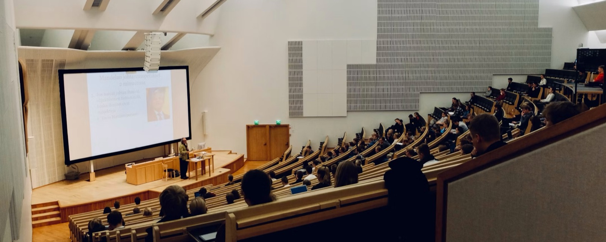

::: {.hero}
# Rafel Cirer-Sastre {.hero-name}

::: {.hero-role}
Associate Professor of Kinesiology · INEFC Lleida, Universitat de Lleida
:::

::: {.hero-lede}
Many measurements strike me as more convincing than reliable.
:::

[PhD opportunity](phd.qmd){.btn-main} [Research](research.qmd){.btn-plain} [Publications](publications.qmd){.btn-plain}
:::

{.banner width="1600" height="640" fig-alt="A university lecture hall during a class."}

That is the thread through everything I work on: how we measure what exercise does to the
body, and what we can claim from what we have measured. Since 2022 I have also coordinated
research support at the centre.

::: {.grid}

::: {.g-col-12 .g-col-md-4}
::: {.line-card}
[Building now]{.line-tag}

### [Strength and muscle mechanics](research.qmd#strength-training-and-muscle-mechanics){.stretched-link}

Whether describing exercise from the perspective of the muscle explains adaptation better
than joint motion alone.
:::
:::

::: {.g-col-12 .g-col-md-4}
::: {.line-card}
[Most applied]{.line-tag}

### [Field-test validation](research.qmd#field-test-validation-and-endurance-performance){.stretched-link}

Where a test a coach can actually run stops being an adequate substitute for a laboratory
protocol.
:::
:::

::: {.g-col-12 .g-col-md-4}
::: {.line-card}
[Established]{.line-tag}

### [Cardiac biomarkers](research.qmd#cardiac-biomarkers-after-exercise){.stretched-link}

How troponin changes after exercise in children and adolescents, and how to read a value
that would alarm a clinician.
:::
:::

:::

Applied biostatistics runs through all three: time-course modelling, Bayesian regression,
systematic review and meta-analysis. [More about the research →](research.qmd)

## The question behind EXCURSE

{.wide}

I lead EXCURSE (2025–2028), funded by INEFC under reference 2025 PINEF 00018 and co-led
with Xavier Peirau Terès.

::: {.band}
## Doctoral candidates

I have room for two doctoral candidates within EXCURSE from late 2026. There is no
predoctoral contract awarded — you would need to win a competitive scholarship — and the
page says so plainly, along with everything else you need before deciding.

[Read the conditions](phd.qmd){.btn-main}
:::

## Contact and profiles

Write to me about EXCURSE, a doctoral project, or a collaboration:
**contacte *at* rafelcirer *dot* com**

::: {.profiles}
- [ORCID 0000-0001-6687-8201](https://orcid.org/0000-0001-6687-8201)
- [Scopus 57194537687](https://www.scopus.com/authid/detail.uri?authorId=57194537687)
- [Publons / Researcher ID G-4163-2015](https://www.webofscience.com/wos/author/record/G-4163-2015)
:::
